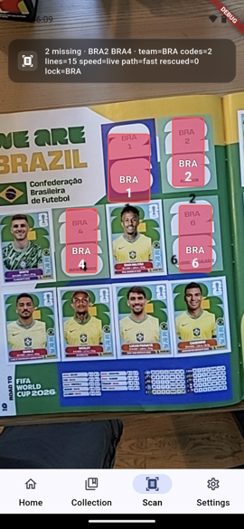
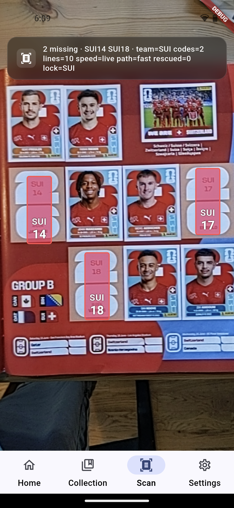
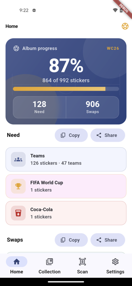
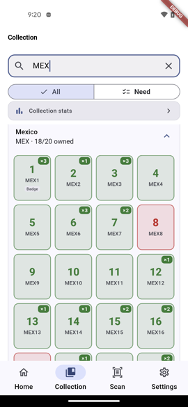
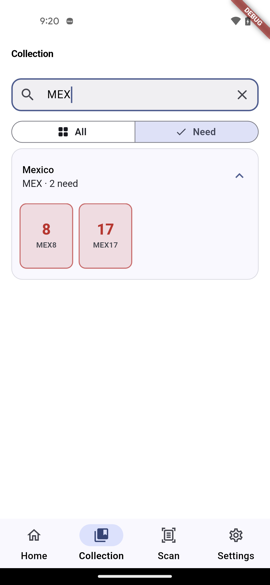
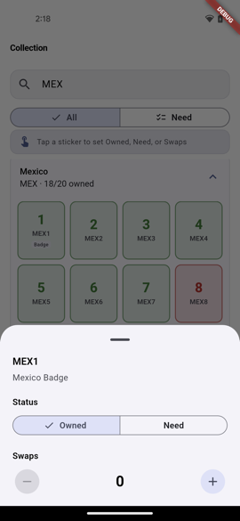
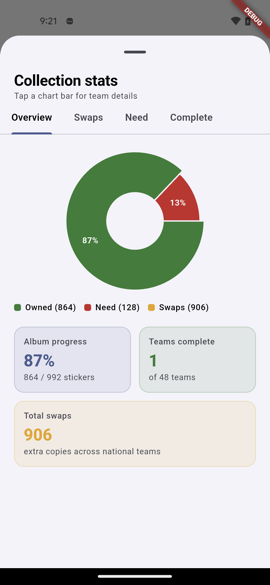
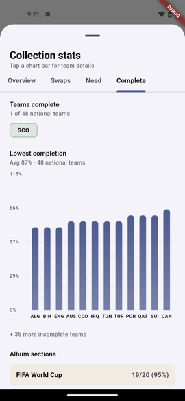
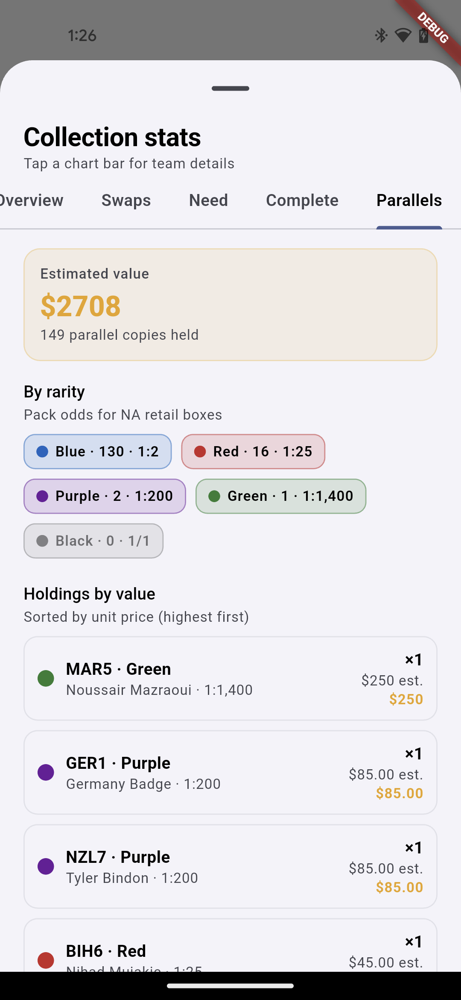

# WC26 Album Tracker

Mobile app for **Panini FIFA World Cup 2026** collectors: scan album pages with the phone camera to mark need stickers, then browse and manage your collection on-device.

## Features

- **Live scan** — ML Kit OCR reads team codes and slot numbers; red overlays on missing stickers; auto-save to SQLite.
- **Home** — Album progress hero; need and swaps summaries split by **48 national teams** vs **FIFA World Cup** / **Coca-Cola** sections.
- **Collection** — Team grid (green owned, red need, swap badges, **parallel color chips**); tap a sticker to set owned, need, swaps, or **parallel counts** (Blue / Red / Purple / Green / Black); search by team code with clear; **Need** filter.
- **Parallel tracking** — Track Blue / Red / Purple / Green / Black parallels separately from album completion (they count as swaps only); rarity odds and estimated sell values in stats.
- **Collection stats** — Charts for overview, swaps, need, completion, and **parallels** (holdings sorted by estimated value).

## AI & computer vision

All scan inference runs **on-device**. Nothing is sent to the cloud.

Empty placeholders print the **team code and slot number** (e.g. `MEX` / `4`). The app reads those labels from the live camera feed with **Google ML Kit text recognition**, pairs reads against the bundled catalog, locks to the active team page, and persists confirmed missing codes.

| Stage | How |
|-------|-----|
| **Input** | Camera frames (NV21/BGRA fast path when available) |
| **OCR** | ML Kit `TextRecognizer` on portrait labels and horizontal FWC codes |
| **Matching** | `PortraitTextMatcher` + page templates for valid sticker codes |
| **Stabilization** | Frame tracker to reduce flicker on noisy reads |
| **Output** | Red overlays on missing slots; auto-save to collection |

Portrait-label OCR was chosen over generic empty-box detection because WC26 layouts mix portrait wells, landscape team photos, and foil types — printed text on empties is more reliable than training one detector for every page geometry.

## Tech stack

| Layer | Technology |
|-------|------------|
| **App** | Flutter 3.5+ (Dart) |
| **Mobile targets** | iOS (Xcode 15+), Android (API 21+) |
| **Computer vision** | Google ML Kit Text Recognition |
| **Camera** | `camera` plugin |
| **Local DB** | SQLite via `sqflite` |
| **State** | Riverpod |
| **Charts** | `fl_chart` |

## Gallery

<table>
<tr>
<td align="center" width="33%">
 
Scan BRA
</td>
<td align="center" width="33%">
 
Scan SUI
</td>
<td align="center" width="33%">
 
Home
</td>
</tr>
<tr>
<td align="center">
 
Collection + parallels
</td>
<td align="center">
 
Collection - Need
</td>
<td align="center">
 
Card Edit
</td>
</tr>
<tr>
<td align="center">
 
Stats - Overview
</td>
<td align="center">
 
Stats - Complete
</td>
<td align="center">
 
Stats - Parallels
</td>
</tr>
</table>

## Development

Build, test, device deploy, and scan pipeline details: **[docs/DEVELOPMENT.md](docs/DEVELOPMENT.md)**

## License

[MIT](LICENSE) — Copyright © 2026 [Amenti Labs, LLC](https://amentilabs.dev/)

This project licenses **source code only**. Panini, FIFA, and related album artwork and trademarks belong to their respective owners and are not covered by this license.
